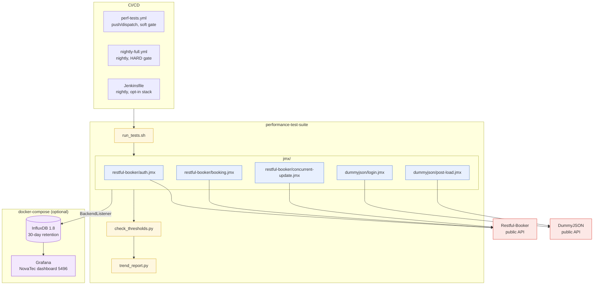

# Performance Testing System

[](https://github.com/Libin-Samkutty/performance-test-suite/actions/workflows/perf-tests.yml)
[](https://github.com/Libin-Samkutty/performance-test-suite/actions/workflows/nightly-full.yml)
[](https://libin-samkutty.github.io/performance-test-suite/)
[](LICENSE)

Automated performance test suite targeting **Restful-Booker** and **DummyJSON** public APIs using Apache JMeter, with CI/CD integration, threshold gating, build-over-build trend analysis, and a Docker/InfluxDB/Grafana observability stack.

This repo is the performance-gate layer of a broader QA portfolio: functional correctness is a minimum bar, but performance is a release requirement. JMeter runs against the same APIs a functional suite would cover, a Python threshold gate (`check_thresholds.py`) compares p90/p95/p99 response time, error rate, and throughput against `config/thresholds.properties`, and fails the build on breach. InfluxDB + Grafana add a second layer on top of the single-run gate — a trend view across the last 30 days, so a slow regression that never breaches the threshold on any one run is still visible as a rising slope.

Complements [`pytest-api-automation`](https://github.com/Libin-Samkutty/pytest-api-automation) (unit/integration/contract/e2e testing, plus a lighter in-process `pytest-benchmark` micro-benchmark layer) and [`postman-newman-automation`](https://github.com/Libin-Samkutty/postman-newman-automation) (collaborative/exploratory API regression) — this is the layer that answers a question those two can't: does the system hold up under sustained concurrent load, and is a slow regression visible before it reaches users?

---

## Table of Contents

1. [Project Overview](#project-overview)
2. [Tech Stack](#tech-stack)
3. [Prerequisites](#prerequisites)
4. [Installation](#installation)
5. [Project Structure](#project-structure)
6. [Architecture](#architecture)
7. [Quick Start](#quick-start)
8. [Test Plans](#test-plans)
9. [Threshold System](#threshold-system)
10. [Trend Analysis](#trend-analysis)
11. [CI/CD Integration](#cicd-integration)
12. [Distributed Testing](#distributed-testing)
13. [InfluxDB + Grafana Observability Stack](#influxdb--grafana-observability-stack)
14. [Known Results & API Limitations](#known-results--api-limitations)
15. [Troubleshooting](#troubleshooting)
16. [Configuration Reference](#configuration-reference)
17. [Engineering Decisions](#engineering-decisions)
18. [License](#license)
19. [References](#references)

---

## Project Overview

Five JMeter test plans exercise two free, public, always-available APIs at increasing levels of realism — a single-endpoint smoke load, a full CSV-parameterised CRUD lifecycle, a concurrency/race-condition stress test, and a spike test — and every run is validated against explicit SLA-style thresholds rather than eyeballed.

| Suite | Target | Purpose |
|---|---|---|
| `restful-booker/auth.jmx` | `POST /auth` | Auth endpoint load — token issuance under concurrent load |
| `restful-booker/booking.jmx` | `/booking` CRUD | Full CSV-parameterised create → read → update → delete lifecycle |
| `restful-booker/concurrent-update.jmx` | `PATCH /booking/{id}` | Race-condition stress test — many threads writing the same resource |
| `dummyjson/login.jmx` | `POST /auth/login` | Spike test — sudden burst of concurrent logins |
| `dummyjson/post-load.jmx` | `/posts` CRUD | Token-authenticated create/read/delete load |

Every suite feeds the same threshold gate (`check_thresholds.py`, `config/thresholds.properties`) and the same trend analyzer (`trend_report.py`), and streams live metrics to InfluxDB/Grafana via a per-suite JMeter Backend Listener — one measurement pipeline behind five different load shapes.

---

## Tech Stack

| Component | Technology |
|---|---|
| Load Testing Tool | Apache JMeter 5.6.3 |
| Runtime | Java 11+ (JMeter), Python 3.8+ (threshold/trend scripts — stdlib only, no third-party deps) |
| Target APIs | [Restful-Booker](https://restful-booker.herokuapp.com/) (public demo), [DummyJSON](https://dummyjson.com) (public demo) |
| Threshold Gate | `scripts/check_thresholds.py` — parses `.jtl`, compares against `config/thresholds.properties` + `config/environments.properties`, exits 1 on breach |
| Trend Analysis | `scripts/trend_report.py` — rolling 7-day baseline vs. current run, exits 2 on >20% regression |
| Time-Series Store | InfluxDB 1.8 (matches the JMeter `InfluxdbBackendListenerClient`'s v1 `/write` API) |
| Dashboards | Grafana 10.4.0 — [JMeter Dashboard by NovaTec](https://grafana.com/grafana/dashboards/5496) (ID 5496), auto-provisioned |
| Containerization | Docker + Docker Compose v2 (`docker compose`, not the deprecated `docker-compose` v1 binary) |
| CI/CD | GitHub Actions (push/dispatch soft gate + nightly hard-gated full-stack run), Jenkins (declarative pipeline, opt-in observability stack) |
| Local Runner | `scripts/run_tests.sh` (bash) — auto-discovers JMeter, drives thresholds + trend analysis in one command |

---

## Prerequisites

| Tool | Version | Notes |
|------|---------|-------|
| Java JDK | 11+ | Required to run JMeter |
| Apache JMeter | 5.6.3 | Auto-located by `run_tests.sh`; see [Installation](#installation) |
| Python | 3.8+ | Required for threshold validation and trend analysis |
| bash | Any | `run_tests.sh` uses bash; Git Bash works on Windows |
| Docker + Docker Compose v2 | Any recent | Optional — only needed for the [InfluxDB + Grafana observability stack](#influxdb--grafana-observability-stack) |

---

## Installation

### 1. Install Java

**Windows**

1. Download the **Java 11 MSI installer** from [https://adoptium.net](https://adoptium.net) — select Java 11, Windows, x64, `.msi`
2. Run the installer and tick **"Set JAVA_HOME variable"** and **"Add to PATH"** when prompted

   Alternatively, install via winget:
   ```cmd
   winget install Microsoft.OpenJDK.11
   ```

3. Ensure Java 11 takes priority if an older version is already installed:
   - Open **Start → "Edit the system environment variables" → Environment Variables**
   - Under **System variables**, verify `JAVA_HOME` points to your Java 11 folder (e.g. `C:\Program Files\Microsoft\jdk-11.0.30.7-hotspot`)
   - Click `Path` → **Edit** → move `%JAVA_HOME%\bin` to the **top** of the list (above any existing Java 8 entries such as `C:\ProgramData\Oracle\Java\javapath`)
   - Click OK on all dialogs, then open a **new** terminal

**Linux (Ubuntu / Debian)**

```bash
sudo apt install openjdk-11-jdk
```

**macOS**

```bash
brew install openjdk@11
```

**Verify (all platforms)**

```bash
java -version
# Expected: openjdk version "11.x.x" ...
```

> **Note:** Java 8 is the minimum JMeter 5.6.x will accept, but this project targets Java 11+. If `java -version` still shows Java 8 after the steps above, confirm `%JAVA_HOME%\bin` is first in your `Path` and that you opened a **new** terminal session.

### 2. Install JMeter

**Windows**

1. Download the `.zip` from [https://archive.apache.org/dist/jmeter/binaries/apache-jmeter-5.6.3.zip](https://archive.apache.org/dist/jmeter/binaries/apache-jmeter-5.6.3.zip)
2. Extract it to a location of your choice (e.g. `C:\Program Files\apache-jmeter-5.6.3`)
3. Set the system environment variables via `Win + R` → `sysdm.cpl` → **Advanced** → **Environment Variables**:
   - In the **bottom (System variables)** section → **New**:
     - Variable name: `JMETER_HOME`
     - Variable value: `C:\Program Files\apache-jmeter-5.6.3`
   - Still in System variables → click **Path** → **Edit → New**, add: `%JMETER_HOME%\bin`
   - Click **OK** on every open dialog (missing one means the change isn't saved)
4. Open a **brand new** CMD window and verify:
   ```cmd
   echo %JMETER_HOME%
   jmeter --version
   ```

> **If `%JMETER_HOME%` still prints literally** (not the path), the variable wasn't saved. Repeat step 3 ensuring you click OK on the "Environment Variables" parent window, not just the inner "Edit" dialog.

**Git Bash on Windows — set PATH permanently in `~/.bashrc`:**

```bash
echo 'export JMETER_HOME="C:/Program Files/apache-jmeter-5.6.3"' >> ~/.bashrc
echo 'export PATH="C:/Program Files/apache-jmeter-5.6.3/bin:$PATH"' >> ~/.bashrc
source ~/.bashrc
jmeter --version
```

**Linux / macOS**

```bash
wget https://archive.apache.org/dist/jmeter/binaries/apache-jmeter-5.6.3.tgz
tar -xzf apache-jmeter-5.6.3.tgz
```

Place the extracted `apache-jmeter-5.6.3/` folder in the project root **or** any directory on your system. The runner will find it automatically if it is placed in the project root. Otherwise, tell the runner where to find it:

```bash
# Option A: set the environment variable before running
export JMETER_HOME=/path/to/apache-jmeter-5.6.3

# Option B: pass it as a flag at runtime
./scripts/run_tests.sh --jmeter-home /path/to/apache-jmeter-5.6.3

# Option C: add jmeter to your PATH
export PATH=$PATH:/path/to/apache-jmeter-5.6.3/bin
```

**JMeter auto-discovery order** (checked in sequence):
1. `$JMETER_HOME/bin/jmeter`
2. `<project-root>/apache-jmeter-5.6.3/bin/jmeter`
3. `/opt/jmeter/bin/jmeter`
4. `/usr/local/jmeter/bin/jmeter`
5. `jmeter` on `$PATH`

### 3. Install Python dependencies

The threshold script has no third-party dependencies — it uses only the Python standard library.

```bash
# Verify Python 3 is available
python3 --version
```

> In CI (GitHub Actions), `jproperties` is installed via pip but is not required for the local scripts.

### 4. Make the runner executable (Linux / macOS)

```bash
chmod +x scripts/run_tests.sh
```

### 5. (Optional) Install Docker + Docker Compose v2

Only needed for the [InfluxDB + Grafana observability stack](#influxdb--grafana-observability-stack) — everything else in this repo runs without it. GitHub-hosted Actions runners ship Docker Compose v2 (the `docker compose` plugin, not the deprecated `docker-compose` v1 binary) pre-installed, so `nightly-full.yml` needs no extra setup step.

---

## Project Structure

```text
performance-test-suite/
├── jmx/                               # JMeter test plans
│   ├── restful-booker/
│   │   ├── auth.jmx                   # Auth endpoint load test (50 threads, 120s)
│   │   ├── booking.jmx                # Full CRUD load test (100 threads, 300s)
│   │   └── concurrent-update.jmx      # Race-condition / concurrency stress test
│   └── dummyjson/
│       ├── login.jmx                  # Login spike test (500 threads, 60s)
│       └── post-load.jmx              # Post CRUD load test (200 threads, 300s)
├── config/
│   ├── thresholds.properties          # Base performance thresholds
│   └── environments.properties        # Per-environment threshold overrides
├── data/
│   └── booking_data.csv               # 20-row parameterised booking test data
├── scripts/
│   ├── run_tests.sh                   # Main local test runner
│   ├── check_thresholds.py            # Threshold validation (exits 1 on breach)
│   ├── trend_report.py                # Build-over-build trend analysis (exits 2 on regression)
│   ├── setup_influxdb.sh              # Creates InfluxDB database + 30-day retention policy
│   └── requirements.txt               # Python deps for docker image build (stdlib-only today)
├── docker/
│   ├── Dockerfile                     # JMeter 5.6.3 headless runner
│   ├── docker-compose.yml             # JMeter + InfluxDB + Grafana stack
│   └── grafana/
│       ├── dashboards/
│       │   └── jmeter-dashboard.json  # NovaTec JMeter dashboard (Grafana ID 5496)
│       └── provisioning/
│           ├── datasources/influxdb.yml
│           └── dashboards/dashboards.yml
├── reports/                           # Auto-generated JMeter HTML dashboard reports
│   ├── restful-booker/                #   → booking.jmx HTML report
│   └── dummyjson/                     #   → post-load.jmx HTML report
├── results/                           # Raw .jtl result files + .log files
│   └── trend_history/                 # Historical .jtl files for trend comparisons
├── .github/workflows/
│   ├── perf-tests.yml                 # Push/dispatch workflow — soft threshold gate
│   └── nightly-full.yml               # Nightly docker-compose run — hard threshold gate
├── Jenkinsfile                        # Jenkins declarative pipeline
└── LICENSE                            # MIT
```

---

## Architecture

```
┌───────────────────────────────────────────────────────────────────────┐
│                       CI/CD GATES  (GitHub Actions / Jenkins)          │
│  push/dispatch → perf-tests.yml         (soft gate, bare-metal)       │
│  nightly 02:00  → nightly-full.yml      (HARD gate, full Docker stack)│
│  nightly 02:00  → Jenkinsfile           (opt-in observability stack)  │
└──────────────────────────────────┬──────────────────────────────────────┘
                                    │ triggers
┌────────────────────────────────────────────────────────────────────────┐
│                         performance-test-suite                          │
│                                                                          │
│   run_tests.sh                                                          │
│     1. Locate JMeter (auto-detect)                                      │
│     2. Run each .jmx suite headlessly  ──────────────►  results/*.jtl   │
│     3. check_thresholds.py  ──►  pass / exit 1 (breach)                 │
│     4. trend_report.py  ──►  compare vs 7-day history, exit 2 (warn)    │
│                                                                          │
│   Every suite's Backend Listener streams live metrics ──────┐          │
└───────────────────────────────────────────────────────────────┼─────────┘
                                                                  │
                     ┌────────────────────────────────────────────┴──────┐
                     │        docker/docker-compose.yml (optional)       │
                     │  ┌───────────┐   provisioned   ┌───────────────┐  │
                     │  │ InfluxDB  │◄────────────────►│    Grafana    │  │
                     │  │  1.8      │  datasource +    │  NovaTec       │  │
                     │  │ 30d       │  dashboard JSON  │  dashboard     │  │
                     │  │ retention │                  │  (ID 5496)     │  │
                     │  └───────────┘                  └───────────────┘  │
                     └────────────────────────────────────────────────────┘
                                    │                        ▲
                     targets        ▼                        │ visualises
 ┌─────────────────────────────┐         ┌──────────────────────────────┐
 │   Restful-Booker (public)   │         │   response time · throughput  │
 │   restful-booker.herokuapp  │         │   · error rate, last 30 days  │
 ├─────────────────────────────┤         └──────────────────────────────┘
 │   DummyJSON (public)        │
 │   dummyjson.com             │
 └─────────────────────────────┘
```

### Component view



---

## Quick Start

### Run the full suite (all tests)

```bash
./scripts/run_tests.sh
```

This runs all five test plans, validates thresholds, and prints a trend comparison (if history is available).

### Run a single suite

```bash
# Only Restful-Booker tests
./scripts/run_tests.sh --suite restful-booker

# Only DummyJSON tests
./scripts/run_tests.sh --suite dummyjson
```

### Run with a custom thread count

```bash
# Override thread count for all tests (useful for smoke testing)
./scripts/run_tests.sh --threads 5
```

### Run against staging thresholds

```bash
./scripts/run_tests.sh --env staging
```

### Skip threshold validation (exploratory run)

```bash
./scripts/run_tests.sh --skip-thresholds
```

### Point to a specific JMeter installation

```bash
./scripts/run_tests.sh --jmeter-home /opt/apache-jmeter-5.6.3
```

### Run threshold validation manually (after a previous test run)

```bash
python3 scripts/check_thresholds.py \
  --results results/ \
  --config config/thresholds.properties \
  --environment production \
  --env-config config/environments.properties
```

### Run trend analysis manually

```bash
python3 scripts/trend_report.py \
  --history results/trend_history/ \
  --current results/ \
  --days 7 \
  --warn-pct 20
```

---

## Test Plans

### Restful-Booker — `auth.jmx`

**Target:** `https://restful-booker.herokuapp.com/auth`

| Parameter | Default | Override via |
|-----------|---------|-------------|
| Threads | 50 | `--threads N` or `-Jthreads=N` |
| Ramp-up | 30s | — |
| Duration | 120s | — |
| Think time | 300 ± 100ms | — |

**Flow:**
1. `POST /auth` with `{ "username": "admin", "password": "password123" }`
2. Asserts HTTP 200 and that the response body contains `"token"`
3. Duration assertion: response must complete within 5 000ms

---

### Restful-Booker — `booking.jmx`

**Target:** `https://restful-booker.herokuapp.com`

| Parameter | Default | Override via |
|-----------|---------|-------------|
| Threads | 100 | `-Jthreads=N` |
| Ramp-up | 60s | `-Jrampup=N` |
| Duration | 300s | `-Jduration=N` |
| Think time | 300 ± 100ms | — |

**Test data:** reads from [`data/booking_data.csv`](data/booking_data.csv) (20 rows, recycled). Each virtual user gets a unique guest name, price, dates, and additional needs.

**Flow per iteration:**
1. **Authenticate (once per thread)** — `POST /auth` → extracts and stores `token` via JSON extractor
2. **Create booking** — `POST /booking` with CSV-driven body → extracts `bookingid`
3. **Read booking** — `GET /booking/{bookingid}` → asserts body contains `firstname`
4. **Update booking** — `PATCH /booking/{bookingid}` → sends `Cookie: token=…`; asserts HTTP 200
5. **Delete booking** — `DELETE /booking/{bookingid}` → sends `Cookie: token=…`; asserts HTTP 201

**Outputs:** `results/restful-booker-booking.jtl` + HTML report at `reports/restful-booker/index.html`

---

### Restful-Booker — `concurrent-update.jmx`

**Target:** `https://restful-booker.herokuapp.com`

| Parameter | Default |
|-----------|---------|
| Threads | 50 |
| Ramp-up | 0s (all threads start simultaneously) |
| Duration | 120s |

**Purpose:** Verifies the API handles concurrent writes to the same resource without returning 500 Internal Server Error or 409 Conflict.

**Flow:**
1. **setUp group (1 thread, runs once):**
   - Authenticates and stores the token as a JMeter *property* (`auth_token`) so it is shared across thread groups
   - Creates a single target booking and stores its ID as a property (`target_bookingid`)
2. **Main group (50 threads):**
   - A Groovy pre-processor loads the shared token and booking ID from properties into thread-local variables
   - Each thread continuously `PATCH`es the same booking with a unique payload containing its thread number and timestamp
   - Each thread then `GET`s the booking to verify it is still readable
   - Assertions check that neither 500 nor 409 is returned

---

### Design Decisions

**Token refresh strategy.** This repo already uses two different token-handling
patterns depending on what each test plan needs: `booking.jmx` uses a
per-thread `OnceOnlyController` (each virtual user authenticates once, for
itself), while `concurrent-update.jmx` uses a shared **setUp Thread Group**
that authenticates once and publishes the token as a JMeter *property* that
every worker thread reads via a JSR223 pre-processor. Neither plan
proactively refreshes the token mid-run — every suite here completes in
60–300 seconds, well under any realistic token TTL, so there's nothing to
refresh. On a longer-running soak test (15+ minutes), the pattern to add is
a Groovy (JSR223) timer that re-authenticates on an interval — or an `If
Controller` keyed on a 401 response — and re-publishes the shared token
property, building directly on the setUp-Thread-Group scaffolding
`concurrent-update.jmx` already has.

**Why there's no "calibration" endpoint.** A common pattern for filtering
infrastructure noise out of a measurement run is a fixed-cost sampler hit
once at suite start, before real measurements begin. It isn't used here
because it wouldn't have caught either of the two real noise sources this
repo documents in [Known Results & API Limitations](#known-results--api-limitations):
Restful-Booker's periodic database reset and DummyJSON's rate limiting both
manifest **mid-run**, under sustained load — not at cold start — so a
start-of-run calibration ping would show clean results right up until the
same failures this repo already explains.

---

### DummyJSON — `login.jmx`

**Target:** `https://dummyjson.com/auth/login`

| Parameter | Default |
|-----------|---------|
| Threads | 500 |
| Duration | 60s |

**Purpose:** Spike test for the authentication endpoint — models a sudden burst of login requests.

**Flow:**
1. `POST /auth/login` with `{ "username": "emilys", "password": "emilyspass", "expiresInMins": 30 }`
2. Asserts HTTP 200

**Output:** `results/dummyjson-login.jtl`

---

### DummyJSON — `post-load.jmx`

**Target:** `https://dummyjson.com`

| Parameter | Default | Override via |
|-----------|---------|-------------|
| Threads | 200 | `-Jthreads=N` |
| Ramp-up | 30s | `-Jrampup=N` |
| Duration | 300s | `-Jduration=N` |
| Think time | 300 ± 100ms | — |

**Flow:**
1. **setUp group (1 thread, runs once):**
   - `POST /auth/login` → extracts `accessToken` and stores it as property `dummyjson_token`
2. **Main load group (200 threads):**
   - Groovy pre-processor loads the shared token per thread
   - Injects `Authorization: Bearer <token>` header
   - `POST /posts/add` — creates a post with a randomised title, body (`__RandomString`), and userId (`__Random(1,100)`)
   - `GET /posts/{random 1–150}` — reads a random existing post
   - `DELETE /posts/{random 1–150}` — deletes a random existing post

**Outputs:** `results/dummyjson-postload.jtl` + HTML report at `reports/dummyjson/index.html`

---

## Threshold System

### How thresholds are applied

Thresholds are checked by `check_thresholds.py` against every `.jtl` file in `results/`. The script:

1. Loads **base thresholds** from `config/thresholds.properties`
2. If `--environment` is provided, overlays matching keys from `config/environments.properties` (e.g., `staging.*` keys replace their base equivalents)
3. Parses each `.jtl` (CSV format) and computes metrics
4. Detects which suite a file belongs to by matching the filename against `restful`/`booker` or `dummyjson`/`dummy` to pick the correct minimum-throughput threshold
5. Exits `0` (pass) or `1` (breach — fails CI)

### Threshold tiers

| | Base | Staging | Production |
|---|---|---|---|
| Avg response time | ≤ 800ms | ≤ 1 200ms | ≤ 600ms |
| p90 response time | ≤ 1 200ms | ≤ 1 800ms | ≤ 900ms |
| p95 response time | ≤ 1 500ms | ≤ 2 200ms | ≤ 1 200ms |
| p99 response time | ≤ 2 000ms | ≤ 3 000ms | ≤ 1 800ms |
| Max response time | ≤ 5 000ms | ≤ 8 000ms | ≤ 4 000ms |
| HTTP error rate | ≤ 1.0% | ≤ 2.0% | ≤ 0.5% |
| Connection timeout rate | ≤ 0.5% | ≤ 1.0% | ≤ 0.2% |
| Assertion failure rate | ≤ 1.0% | ≤ 2.0% | ≤ 0.5% |
| Min TPS (Restful-Booker) | ≥ 10 | ≥ 5 | ≥ 15 |
| Min RPS (DummyJSON) | ≥ 30 | ≥ 15 | ≥ 40 |

> **Staging** thresholds are relaxed (shared/lower-spec environments).
> **Production** thresholds are stricter than the base defaults.

### Selecting an environment

```bash
# Use base thresholds (default)
./scripts/run_tests.sh

# Use staging thresholds
./scripts/run_tests.sh --env staging

# Use production thresholds
./scripts/run_tests.sh --env production
```

### Adding or changing a threshold

Edit [`config/thresholds.properties`](config/thresholds.properties) for the base values, or [`config/environments.properties`](config/environments.properties) for environment-specific overrides:

```properties
# Example: tighten the p95 base threshold
p95.response.time.max=1200

# Example: add a custom staging override
staging.p95.response.time.max=2000
```

---

## Trend Analysis

`trend_report.py` provides build-over-build visibility to catch gradual performance regressions that stay within thresholds individually.

### How it works

1. Reads all `.jtl` files from `results/trend_history/` that were modified within the last 7 days
2. Averages their metrics (avg, p90, p95, p99, error rate, throughput) to form a baseline
3. Compares the current run's metrics against the baseline
4. Flags any metric that has **increased by more than 20%** (or dropped by 20% for throughput)
5. Exits `2` on warnings (soft failure — the pipeline treats this as non-blocking with `|| true`)

### Archiving results for trend tracking

After each run, copy the current `.jtl` files into `results/trend_history/` to build up a history:

```bash
cp results/*.jtl results/trend_history/
```

In CI (GitHub Actions), the `trend_history/` directory is cached using `actions/cache` keyed by branch name, so history accumulates across runs automatically.

### Customising the lookback or warning threshold

```bash
# Look back 14 days and warn at 30% regression
python3 scripts/trend_report.py \
  --history results/trend_history/ \
  --current results/ \
  --days 14 \
  --warn-pct 30
```

---

## CI/CD Integration

### GitHub Actions

**File:** [`.github/workflows/perf-tests.yml`](.github/workflows/perf-tests.yml)

**Triggers:**

| Trigger | Condition | Default suite | Default env |
|---------|-----------|--------------|-------------|
| `push` | `develop` branch | all | production |
| `workflow_dispatch` | Manual (UI or API) | selectable | selectable |

> **Note:** A nightly cron trigger is commented out in this workflow file
> (it runs bare-metal against public APIs that are known to rate-limit/reset,
> so it's not scheduled unattended by default). The dedicated nightly job
> with a full observability stack and a hard threshold gate is
> [`nightly-full.yml`](#nightly-full-observability-run), below.

**What the workflow does:**

1. Checks out the repository
2. Sets up Java 11 (Temurin) and Python 3.11
3. Downloads and caches JMeter 5.6.3
4. Prepares output directories
5. Runs each test plan with `jmeter -n` (continues on individual test error)
6. Validates thresholds with `check_thresholds.py` — **soft gate**: `continue-on-error: true` is set deliberately, because these free public APIs (DummyJSON rate limiting, Restful-Booker's periodic DB reset) produce real breaches unrelated to code regressions. A breach is surfaced as a GitHub Actions warning annotation, not a failed build. See [`nightly-full.yml`](#nightly-full-observability-run) for the hard-gated equivalent.
7. Restores the trend history cache, runs `trend_report.py`, and saves the updated cache
8. Uploads two artifacts (retained for 30 days):
   - `performance-reports-<run#>` — HTML dashboard reports
   - `raw-results-<run#>` — `.jtl` files and JMeter logs
9. Writes a summary table to the GitHub Actions job summary page

**Manual dispatch options (via GitHub UI → Actions → Run workflow):**

| Input | Options | Default |
|-------|---------|---------|
| `test_suite` | `all`, `restful-booker`, `dummyjson` | `all` |
| `environment` | `production`, `staging` | `production` |
| `threads_override` | Any integer (leave blank for defaults) | — |

### Nightly Full Observability Run

**File:** [`.github/workflows/nightly-full.yml`](.github/workflows/nightly-full.yml)

Distinct from `perf-tests.yml` above, this workflow runs the full Docker/
InfluxDB/Grafana stack and enforces a **hard** threshold gate — no
`continue-on-error`, so a genuine breach fails the build.

**Triggers:** `schedule: cron '0 2 * * *'` (nightly, 02:00 UTC — matches the
Jenkinsfile's `H 2 * * *`) + `workflow_dispatch` with the same `test_suite`/
`environment` inputs as `perf-tests.yml`.

**What it does:**

1. Starts `influxdb` + `grafana` via `docker compose -f docker/docker-compose.yml up -d`
2. Runs `scripts/setup_influxdb.sh` to create the `jmeter` database and a 30-day retention policy
3. Runs each test plan via `docker compose run --rm jmeter ...`, with `-Jinfluxdb_url=http://influxdb:8086/write?db=jmeter` so the JMeter Backend Listener streams live metrics into InfluxDB
4. Validates thresholds with `check_thresholds.py` — **no `continue-on-error`**: a breach fails the job
5. Runs `trend_report.py` against a cached `results/trend_history/`
6. Uploads `reports/` and `results/` as artifacts (30-day retention)
7. Captures a real Grafana dashboard screenshot via the `renderer` service (`grafana-image-renderer`), failing the job if the render doesn't return a valid PNG
8. Tears down the stack with `docker compose down -v`
9. Publishes the screenshot to GitHub Pages (`actions/upload-pages-artifact` + a second `publish-dashboard` job running `actions/deploy-pages`) — see [InfluxDB + Grafana Observability Stack](#influxdb--grafana-observability-stack) for the live link

---

### Jenkins

**File:** [`Jenkinsfile`](Jenkinsfile)

**Prerequisites on the Jenkins agent:**

- Java 11+
- Python 3.8+ with `jproperties` installed (`pip install jproperties`)
- JMeter 5.6.3 registered as a Custom Tool named **`JMeter-5.6.3`** in *Manage Jenkins → Global Tool Configuration*
- Docker + Docker Compose v2 — **only required if `ENABLE_OBSERVABILITY=true`**; the default pipeline runs bare-metal JMeter with no Docker dependency

**Pipeline stages:**

| Stage | Description |
|-------|-------------|
| Setup | Prints run parameters, creates output dirs, verifies JMeter/Java/Python versions |
| Start Observability Stack | Opt-in (`ENABLE_OBSERVABILITY=true`): `docker compose up -d influxdb grafana` + `scripts/setup_influxdb.sh` |
| Restful-Booker Tests | Runs `auth.jmx`, `booking.jmx`, `concurrent-update.jmx` in sub-stages |
| DummyJSON Tests | Runs `login.jmx`, `post-load.jmx` in sub-stages |
| Validate Thresholds | Runs `check_thresholds.py` — stage **fails** on breach (skipped if `SKIP_THRESHOLDS=true`) |
| Trend Analysis | Runs `trend_report.py` — non-blocking |

When `ENABLE_OBSERVABILITY=true`, every JMeter invocation additionally
passes `-Jinfluxdb_url=http://localhost:8086/write?db=jmeter` (bare-metal
JMeter talking to the dockerized InfluxDB over its published port), and the
`post { always { ... } }` block tears the stack down with
`docker compose down -v`.

**Pipeline parameters (set at build time):**

| Parameter | Type | Options / Default |
|-----------|------|------------------|
| `TEST_SUITE` | Choice | `all` / `restful-booker` / `dummyjson` |
| `ENVIRONMENT` | Choice | `production` / `staging` |
| `THREADS_OVERRIDE` | String | empty (uses JMX defaults) |
| `SKIP_THRESHOLDS` | Boolean | `false` |
| `ENABLE_OBSERVABILITY` | Boolean | `false` — starts InfluxDB + Grafana via docker compose for live dashboards |

**Trigger:** Nightly at 02:00 UTC via `cron('H 2 * * *')`.

**Post-build actions:**

- HTML reports published via `publishHTML` (requires HTML Publisher plugin)
- `.jtl` and `.log` files archived as build artifacts
- Slack notification block is included but **commented out** — uncomment and configure the channel to enable alerts

**Registering JMeter as a Custom Tool in Jenkins:**

1. Install the **Custom Tools Plugin**
2. Go to *Manage Jenkins → Global Tool Configuration → Custom Tool Installations*
3. Add a tool named `JMeter-5.6.3`, download URL: `https://archive.apache.org/dist/jmeter/binaries/apache-jmeter-5.6.3.tgz`
4. Set the label to match your agent label (or leave blank for all agents)

---

## Distributed Testing

For load scenarios requiring more than 500 concurrent users, use JMeter in distributed (remote) mode. One controller machine coordinates multiple worker (agent) machines.

**On each worker machine:**

```bash
# Start the JMeter remote server (listens on port 1099 by default)
${JMETER_HOME}/bin/jmeter-server
```

**On the controller machine:**

```bash
jmeter -n -t jmx/restful-booker/booking.jmx \
  -l results/booking-distributed.jtl \
  -r \
  -Jremote_hosts=worker1:1099,worker2:1099
```

> All machines must have the same JMeter version, and the test data file (`data/booking_data.csv`) must be present on every worker at the same relative path.

---

## InfluxDB + Grafana Observability Stack

Every test plan has an **InfluxDB Backend Listener**, enabled by default,
that streams live metrics to InfluxDB during the test run for Grafana to
visualise. The `influxdbUrl` argument is parameterised —
`${__P(influxdb_url,http://localhost:8086/write?db=jmeter)}` — so it
defaults to the host-published port for bare-metal runs and can be
overridden to the in-container service name (`http://influxdb:8086/...`)
when JMeter itself runs inside `docker compose`.

### Running the full stack

```bash
cd docker
docker compose up -d influxdb grafana
bash ../scripts/setup_influxdb.sh      # creates the jmeter DB + 30-day retention policy
docker compose run --rm jmeter \
  -n -t /jmeter/jmx/restful-booker/booking.jmx \
  -l /jmeter/results/booking.jtl \
  -e -o /jmeter/reports/dashboard \
  -Jinfluxdb_url=http://influxdb:8086/write?db=jmeter
```

Open Grafana at `http://localhost:3000` (`admin` / `admin`). The
**JMeter Dashboard by NovaTec** (Grafana dashboard ID **5496**) is
pre-provisioned — no manual import needed — via:

- `docker/grafana/provisioning/datasources/influxdb.yml` — auto-registers the InfluxDB datasource
- `docker/grafana/provisioning/dashboards/dashboards.yml` — auto-loads `docker/grafana/dashboards/jmeter-dashboard.json`

The dashboard's default time range is set to the last 30 days, matching the
`setup_influxdb.sh` retention policy, so trend history is available at a
glance rather than only the current run.

### Live dashboard on GitHub Pages

`nightly-full.yml` captures a real Grafana screenshot every run — via a
dedicated `grafana-image-renderer` service (see [Engineering
Decisions](#engineering-decisions) for why it's a separate service rather
than a plugin bundled into the Grafana image) — and publishes it to
GitHub Pages using the same `actions/upload-pages-artifact` +
`actions/deploy-pages` flow [`pytest-api-automation`](https://github.com/Libin-Samkutty/pytest-api-automation)
uses for its Allure report:

**[→ View the latest dashboard](https://libin-samkutty.github.io/performance-test-suite/)**


*(Populated after the first `nightly-full.yml` run — this is a live,
recurring capture, not a one-time screenshot committed to the repo.)*

### Running bare-metal JMeter against the dockerized stack

If you'd rather run JMeter directly (as `run_tests.sh`, `perf-tests.yml`,
and the default Jenkinsfile path all do) while still getting live
dashboards, start just the observability containers and point at the
published port:

```bash
cd docker && docker compose up -d influxdb grafana && bash ../scripts/setup_influxdb.sh
cd .. && ./scripts/run_tests.sh --suite restful-booker
# BackendListener defaults to http://localhost:8086/write?db=jmeter — no -J flag needed
```

This is exactly what Jenkins does when `ENABLE_OBSERVABILITY=true` (see
[Jenkins](#jenkins), above).

---

## Known Results & API Limitations

> These results reflect a full suite run against the public demo APIs. Both targets are free, shared, community-facing endpoints — they are not designed for sustained performance testing at the thread counts this suite uses. The results below are the **expected, reproducible behaviour** of this suite against those APIs, not bugs in the test implementation.

### Result summary

| Test | Samples | Error Rate | Avg (ms) | p95 (ms) | TPS | Threshold Result |
|---|---|---|---|---|---|---|
| `restful-booker/auth.jmx` | 9,917 | 0% | 232 | 262 | 83 | ✅ All passed |
| `restful-booker/concurrent-update.jmx` | 19,108 | 0.01% | 314 | 396 | 156 | ✅ All passed |
| `restful-booker/booking.jmx` | 49,830 | 33% | 242 | 256 | 166 | ❌ Error rate & max response time |
| `dummyjson/login.jmx` | 45,339 | 90.2% | 336 | 712 | 757 | ❌ Error rate & p99 |
| `dummyjson/post-load.jmx` | 1 | 100% | 731 | — | 0 | ❌ Did not run |

---

### restful-booker — `booking.jmx` (33% error rate on PATCH / DELETE)

**Endpoint breakdown:**

| Endpoint | Errors | Error % | Primary code |
|---|---|---|---|
| `POST /auth` | 0 / 100 | 0% | 200 |
| `POST /booking` | 23 / 12,472 | 0.2% | 200, 503 |
| `GET /booking/{id}` | 22 / 12,443 | 0.2% | 200, 404 |
| `PATCH /booking/{id}` | 8,201 / 12,418 | **66%** | **403**, 200 |
| `DELETE /booking/{id}` | 8,209 / 12,397 | **66%** | **403**, 201 |

**Root cause — periodic database reset:** The Restful-Booker demo API resets its entire database approximately every 10 minutes. When this happens mid-run, all existing auth tokens are invalidated server-side. Threads that were issued tokens before the reset receive `403 Forbidden` on every subsequent PATCH and DELETE for the remainder of the 300s test. The auth design (once per thread via `OnceOnlyController`) is correct — the tokens simply stop being honoured after the reset occurs.

**Auth design is intentional and correct:** Each thread authenticates once at startup using a `OnceOnlyController` and holds its own thread-local token. This matches the README spec and is the right approach — a shared setUp token would be equally affected by server-side resets.

**This is not a test suite bug.** If run against a real or self-hosted instance of the Restful-Booker API, no resets occur and the error rate drops to near-zero.

---

### dummyjson — `login.jmx` (90% error rate)

**Response code distribution:**

| Code | Count | % | Meaning |
|---|---|---|---|
| 429 Too Many Requests | 39,296 | 86.7% | Rate limit hit |
| 200 OK | 4,435 | 9.8% | Success |
| 401 Unauthorized | 1,608 | 3.5% | Credential rejected under load |

**Root cause — aggressive rate limiting:** The DummyJSON public API enforces a strict per-IP (and likely global) rate limit on the `/auth/login` endpoint. Firing 500 threads simultaneously with a 5s ramp-up exhausts the rate limit window within the first few seconds. The 9.8% success rate represents requests that landed before the limit was hit.

**This is expected and by design:** `login.jmx` is a **spike test** — its purpose is to characterise how the API behaves under sudden burst load. The 429 responses *are* the finding: the API's rate limiter activates immediately at this scale.

---

### dummyjson — `post-load.jmx` (did not run)

**Root cause — setUp blocked by rate limit:** When `post-load.jmx` runs immediately after `login.jmx`, the DummyJSON API's rate limit window is still active. The single setUp thread's `POST /auth/login` receives a `429`, no token is extracted, and the `stoptestnow` error policy on the setUp group halts the entire test before the main 200-thread group starts.

**Workaround:** Wait a few minutes between running `login.jmx` and `post-load.jmx`, or run them in separate suites with a delay:
```bash
# Run DummyJSON tests with a cooldown between them
./scripts/run_tests.sh --suite restful-booker
sleep 120
./scripts/run_tests.sh --suite dummyjson
```

---

### Summary: what is and isn't a real failure

| Failure | Real issue? | Explanation |
|---|---|---|
| `booking.jmx` PATCH/DELETE 403s | No | Public API database reset mid-run |
| `login.jmx` 429s | Expected | Spike test finding — rate limiter activates as designed |
| `post-load.jmx` not running | Avoidable | Run after a cooldown period post `login.jmx` |
| `booking.jmx` max response time >4 000ms | Minor | Occasional slow responses on shared Heroku infra |

None of the above reflect defects in the test suite. Against a stable, non-rate-limited API these tests would pass threshold validation cleanly.

---

## Troubleshooting

### JMeter not found

```
✗ JMeter not found.
  Set JMETER_HOME or pass --jmeter-home <path>
```

Set the environment variable or pass the flag:
```bash
export JMETER_HOME=/path/to/apache-jmeter-5.6.3
# or
./scripts/run_tests.sh --jmeter-home /path/to/apache-jmeter-5.6.3
```

### No `.jtl` files found during threshold validation

The threshold script only processes files already present in `results/`. If a test failed to produce a `.jtl`, check the corresponding `.log` file:
```bash
cat results/restful-booker-booking.log
```

### Token not extracted (TOKEN_NOT_FOUND in logs)

The Restful-Booker API occasionally returns a `Bad credentials` error if you have exceeded rate limits. Wait a few minutes and retry. The API credentials are hardcoded in the JMX files: `username: admin` / `password: password123`.

### Trend analysis shows no historical data

```
No historical data available. Skipping trend analysis.
TIP: Archive .jtl files to results/archive/ after each run.
```

Manually copy `.jtl` files to `results/trend_history/` after your first run:
```bash
cp results/*.jtl results/trend_history/
```

### Python not found

```
✗ Python not found — skipping threshold check.
```

The script looks for `python3` then `python`. Ensure Python 3 is installed and on your `$PATH`:
```bash
python3 --version
```

### HTML report already exists error

JMeter refuses to overwrite an existing report directory. The runner cleans the report directory before each run automatically. If running JMeter manually, delete the directory first:
```bash
rm -rf reports/restful-booker/*
jmeter -n -t jmx/restful-booker/booking.jmx -l results/booking.jtl -e -o reports/restful-booker/
```

### Grafana panels show "datasource not found" or no data

Confirm `docker compose ps` shows `influxdb` as `healthy` before running any JMeter suite — the Backend Listener fails silently (logged, not a test failure) if InfluxDB isn't reachable yet. Then confirm data actually arrived:
```bash
curl "http://localhost:8086/query?db=jmeter" --data-urlencode 'q=SHOW MEASUREMENTS'
```
If `jmeter` isn't listed, re-run `bash scripts/setup_influxdb.sh` (creates the database if it's missing) and re-run the suite with `-Jinfluxdb_url=http://influxdb:8086/write?db=jmeter`.

---

## Configuration Reference

### `scripts/run_tests.sh` flags

| Flag | Default | Description |
|------|---------|-------------|
| `--suite` | `all` | `all`, `restful-booker`, or `dummyjson` |
| `--env` | `production` | Threshold environment: `production` or `staging` |
| `--threads` | (JMX default) | Override thread count for all test plans |
| `--jmeter-home` | (auto-detect) | Path to JMeter installation directory |
| `--skip-thresholds` | false | Skip `check_thresholds.py` entirely |
| `-h` / `--help` | — | Print usage and exit |

### JMeter properties passed at runtime

| Property | Used by | Purpose |
|----------|---------|---------|
| `-Jenvironment` | All JMX files | Passed through; used for environment-aware logic |
| `-Jthreads` | `booking.jmx`, `auth.jmx`, `concurrent-update.jmx`, `post-load.jmx` | Overrides default thread count |
| `-Jrampup` | `booking.jmx`, `post-load.jmx` | Overrides ramp-up period in seconds |
| `-Jduration` | `booking.jmx`, `post-load.jmx` | Overrides test duration in seconds |
| `-Jinfluxdb_url` | All JMX files (Backend Listener) | Overrides the InfluxDB write endpoint — host-published port for bare-metal runs, in-container service name for dockerized runs |

### `config/thresholds.properties`

```properties
# ============================================================
# Performance Thresholds Configuration
# ============================================================
# These thresholds are enforced by scripts/check_thresholds.py.
# A breach of any threshold causes the CI pipeline to fail.
# ============================================================

# --- Response Time (milliseconds) ---
avg.response.time.max=800
p90.response.time.max=1200
p95.response.time.max=1500
p99.response.time.max=2000
max.response.time.max=5000

# --- Error Rates (percentage) ---
http.error.rate.max=1.0
connection.timeout.rate.max=0.5
assertion.failure.rate.max=1.0

# --- Throughput (transactions per second) ---
min.tps.restful_booker=10
min.rps.dummyjson=30
```

### `config/environments.properties`

Keys follow the pattern `<environment>.<base-key>`. Any key present here with a matching `--environment` value **overrides** the corresponding base threshold.

```properties
# Staging — relaxed thresholds for shared/lower-spec environments
staging.avg.response.time.max=1200
staging.p95.response.time.max=2200
staging.http.error.rate.max=2.0
staging.min.tps.restful_booker=5
# ... (see file for full list)

# Production — stricter thresholds
production.avg.response.time.max=600
production.p95.response.time.max=1200
production.http.error.rate.max=0.5
production.min.tps.restful_booker=15
# ... (see file for full list)
```

---

## Engineering Decisions

**Additive, not a rewrite, for CI/CD migration.** The initial build-out
added the entire Docker/InfluxDB/Grafana stack, but deliberately left
`perf-tests.yml` and the default Jenkinsfile path untouched rather than
migrating them to run JMeter via `docker compose`. `perf-tests.yml`'s
threshold step has an intentional soft gate (`continue-on-error: true`)
because these free public APIs really do produce breaches unrelated to
code regressions (see [Known Results](#known-results--api-limitations)) —
adding Docker to every push-triggered run would add new failure surface
(image builds, compose version drift) for a workflow that was never meant
to be a hard gate. The hard gate and full observability stack live only in
the new, dedicated `nightly-full.yml`; Jenkins got an opt-in
`ENABLE_OBSERVABILITY` parameter instead of a rewrite, so the
documented zero-Docker-prerequisite default pipeline still works exactly
as before.

**`docker compose`, not `docker-compose`.** GitHub-hosted Actions runners
upgraded to Docker Compose v2 and dropped the standalone `docker-compose`
v1 binary as of a February 2026 runner image update — every compose
invocation in this repo (`nightly-full.yml`, Jenkinsfile, README examples)
deliberately uses the `docker compose` (space) plugin syntax so it keeps
working on current and future hosted runners.

**BackendListener enabled by default, not opt-in.** All five JMX files ship
with the InfluxDB Backend Listener `enabled="true"` and a parameterised
`influxdb_url` (`${__P(influxdb_url,http://localhost:8086/write?db=jmeter)}`)
rather than `enabled="false"` needing a manual GUI toggle. This is safe
because `InfluxdbBackendListenerClient` sends metrics asynchronously —
verified directly against this repo's own suites: running
`restful-booker/auth.jmx` with no InfluxDB listening at all produced
`ERROR o.a.j.v.b.i.HttpMetricsSender: failed to send data to influxDB
server` in the suite log every ~5 seconds, while the actual HTTP load test
completed normally with real samples and a correct threshold-gate result.
Bare-metal runs pay no cost for the listener being enabled.

**The NovaTec dashboard's datasource resolves itself — no JSON patching
needed.** The downloaded dashboard JSON (Grafana ID 5496) uses a built-in
`datasource`-type template variable (`query: "influxdb"`) rather than a
static `${DS_INFLUXDB}` input reference, so Grafana auto-selects the single
provisioned InfluxDB datasource by plugin type at load time — no manual
edit of the dashboard JSON was needed to wire it up, only the time-range
default (`now-30d` to `now`, to match the 30-day retention policy).

**Grafana image rendering as its own service, not a plugin bundled into
the Grafana image.** `GF_INSTALL_PLUGINS=grafana-image-renderer` installs
the renderer inside the main Grafana container, but its bundled headless
Chromium needs OS-level libraries (fonts, `libX11`, `libgtk`, …) the base
`grafana/grafana` image doesn't ship, making that path flaky. Running
`grafana/grafana-image-renderer` as its **own** compose service and
pointing Grafana at it via `GF_RENDERING_SERVER_URL`/
`GF_RENDERING_CALLBACK_URL` is Grafana's own documented production
pattern — it isolates the heavy rendering dependency from the dashboard
server itself, and is what makes `nightly-full.yml`'s screenshot capture
a real `/render` call against a working renderer rather than the earlier
"best-effort, likely to fail" placeholder.

**A fixed dashboard `uid`, not an auto-generated one.** The downloaded
NovaTec dashboard JSON ships with no `uid` field, so Grafana would assign
a random one on every fresh provision — making the `/render/d/<uid>/...`
URL a moving target across environments. Added an explicit
`"uid": "jmeter-performance"` to the dashboard JSON so the render URL
(and the GitHub Pages screenshot pipeline that depends on it) is stable.

**Why the InfluxDB healthcheck's `curl` call is safe.** The compose
healthcheck (`curl -f http://localhost:8086/ping`) depends on `curl`
existing inside the `influxdb:1.8` image — confirmed by inspecting the
image's actual build layers (`buildpack-deps:bullseye-curl` base +
an explicit `apt-get install ... curl ...` layer), not assumed from the
Dockerfile snippet in earlier drafts of this stack.

**A real bug in `run_tests.sh`'s trend-analysis call, found and fixed.**
The script was invoking `trend_report.py` with flags that don't exist
(`--results`, `--build`, `--timestamp` instead of the real `--current`),
silently swallowed by a trailing `|| true` — so local runs never actually
computed a trend, they just printed nothing and moved on. Fixed to call
`trend_report.py --current "${RESULTS_DIR}/" --history
"${TREND_HISTORY}/"`, matching the invocation `perf-tests.yml` and the
Jenkinsfile already used correctly. Verified by re-running the suite live
and confirming the "Performance Trend Analysis" banner and its real
history/lookback fields now print instead of nothing.

---

## License

MIT License — see [LICENSE](LICENSE) for details.

## References

- [Apache JMeter Documentation](https://jmeter.apache.org/usermanual/index.html)
- [JMeter InfluxDB Backend Listener](https://jmeter.apache.org/usermanual/realtime-results.html)
- [InfluxDB 1.8 Documentation](https://docs.influxdata.com/influxdb/v1/)
- [Grafana Documentation](https://grafana.com/docs/grafana/latest/)
- [JMeter Dashboard by NovaTec (Grafana ID 5496)](https://grafana.com/grafana/dashboards/5496)
- [Docker Compose Documentation](https://docs.docker.com/compose/)
- [Restful-Booker API Documentation](https://restful-booker.herokuapp.com/apidoc/index.html)
- [DummyJSON API Documentation](https://dummyjson.com/docs)
- [Jenkins Declarative Pipeline Syntax](https://www.jenkins.io/doc/book/pipeline/syntax/)
